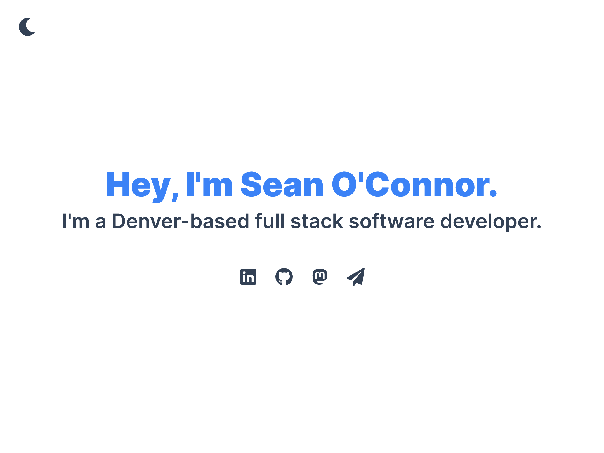
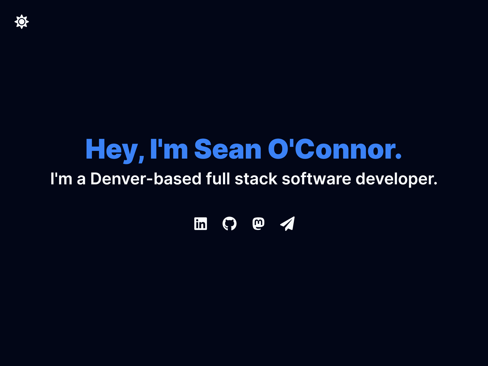

# seano.dev

My personal website. Built with [Next.js 13](https://nextjs.org/) and using [Tailwind CSS](https://tailwindcss.com/).

## License

My code is distributed under the [CC0-1.0](LICENSE) license.
 
This project uses open-source software that may be licensed differently.
